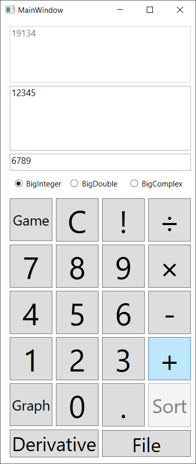

# Engineer Calculator

A WPF utility combining three tools in one app:

- **Scientific/engineer calculator**
- **Graph plotter** — draws function curves (`GraphForm`)
- **Game** — a small matematical bundled game screen

Built in C# as a WPF application.

## Tech
- **Language:** C# / .NET Framework (WPF)
- **UI:** WPF with custom-drawn graph surface
- **Assets:** play/pause/settings icons + a brick-pattern sample image


## Screenshot


_BigInteger mode: 12345 + 6789 = 19134_

## Building
- **Visual Studio 2019+**, targets an older .NET Framework.
- Open `Engineer Calculator.sln` and build.
## Building

- **Visual Studio 2019+** (or newer) — the solution targets .NET Framework 4.x.
- NuGet packages restore automatically on build (the old `packages/` folder is
  intentionally gitignored — `nuget restore` / VS restore brings them back).
- Build: open the `.sln` and hit Build, or:
  ```
  msbuild <Solution>.sln /p:Configuration=Debug
  ```

